Learn about Coordinated Omission, the root cause and its effects. After reading this post you should be able to answer questions such as "What is Coordinated Omission?", "How does it effect benchmark results", "How can we design a load test that does not suffer from coordinated omission" and "does my tool suffer from the coordinated omission problem?"

== Tl;dr

Coordinated Omission occurs when the load generator we choose is not able to accurately create a workload representative of real world traffic whilst load testing a remote service. 

There is a "Coordination" from the System Under Test applying indirect back pressure to the load driver, that causes the load driver to "Omit" any number of valid results. The System Under Test can blocks the load generator, severely skewing it's measurements.

Response time metrics measured with tools that suffer from Coordinated Omission are far from misleading, they are wrong. The worst part is, the load generator can not detect or inform users that the results are incorrect.

Using tools such as https://hyperfoil.io/[Hyperfoil], you can be sure that any response time metrics it captures are accurate; or, if it detects back-pressure from the System Under Test, it will record and report the unintended back-pressure.

== Tell me about this Coordinated Omission thingy!

_Coordinated Omission_ is a term that has been in circulation for a while now. There are many articles that describe; for more detailed explanations of coordinated omission, please take a look at <<Further Reading>>.

Before exploring the nuances of coordinated omission, lets get clear in our minds what it is we are trying to do when we are measuring system "response time".

Imagine a scenario where we run a call center for a building materials trade counter (*Building Star Trade Supplies Inc*)

Our tag line is "*_Building Star Trade Supplies Inc: the best in the world for all your building supply needs!_*"

To improve customer experience, we want to reduce the time it takes for our customers to place an order. The faster customers can place an order, the happier they are, and the faster we can build a world beating business!

What do we need to do; measure how long it takes to place a telephone order through our switchboard.

If it takes longer than 1 minute to place an order we will start to loose market share to our rivals _Prime Materials Supplies_. 

=== A typical interaction

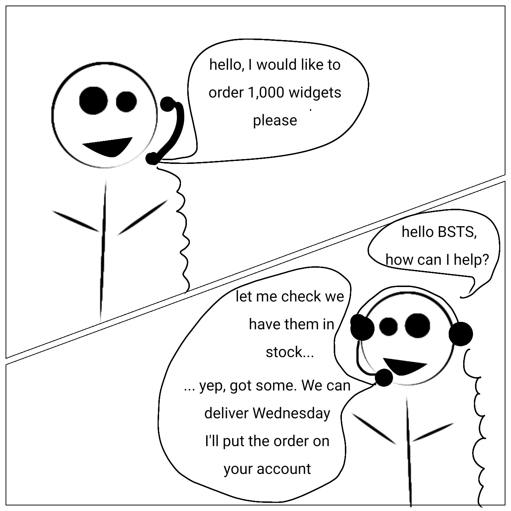

Typically a customer calls the call center, is put through to an operator, where the operator checks stock levels, raises a new order and confirms with the customer before terminating tha call.

=== How long does it take to place an order?

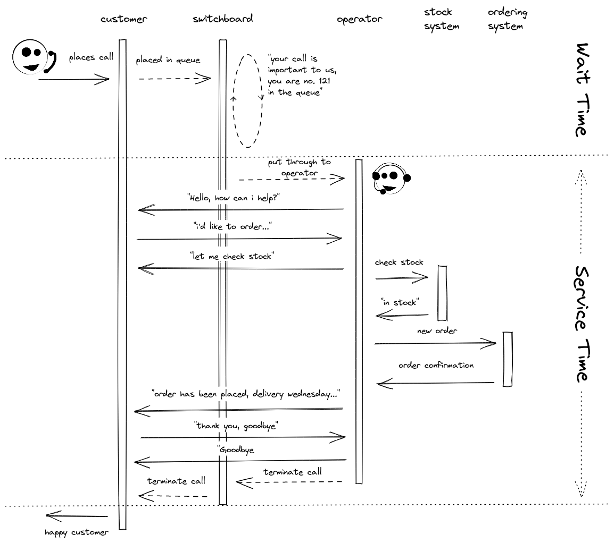

There are 2 main components in the time taken to place the order;  

* the *"Wait Time"* the customer was being held in the switchboard queue before being put through the operator
* The *"Service Time"* it took for the operator to process the customer request

From the customers point-of-view, the total *"Order Time"* (i.e. the time taken to place the order) is ;

[IMPORTANT]
====
*"Order Time" = "Wait Time" + "Service Time"*

To measure the performance of our call center, we need to measure the total "Order Time".

*If it only takes a single operator 30 seconds to process an order request, but customers are waiting on average 30 minutes to be connected to them, the customer experience is poor*
====

== What does a call center have to do with my Web Service?!?

There are a lot of similarities between a call center and a Web Service. 

[NOTE]
====
Any number of _customers_ (*clients*) can _call_ (*tcp_socket::open*) our _switchboard_ (*web service*), where an _operator_ (*thread*) will process the _enquiry_ (*request*), interacting with multiple _systems_ (*backend services*) before confirming an _order_ (*response*) and terminating the _call_ (*tcp_socket::close*). 

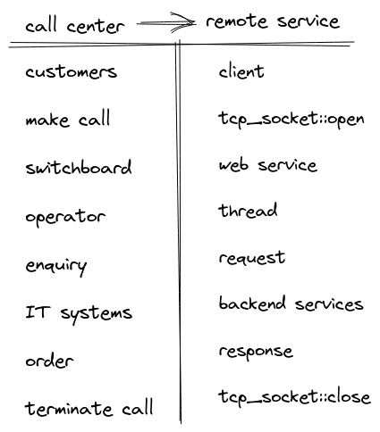

====

Typically for us developers of web services; before we push our changes into production, we want to know how it will scale or perform under sustained client load. So, we build a benchmark, take some measurements and deploy depending on if we see acceptable performance.

But *how* do we measure performance of a web service? What decisions do we take, and how does this impact our confidence in how our web service performs. 

== Measuring System performance

So, you've been tasked with ensuring the application can handle production workload. The checklist typically looks something like;

* [*] pick a load generation tool
* [*] setup benchmarking environment
* [*] run load generation tool against test environment
* [x] ensure the system response times are within required SLA's
* [ ] ship it!

[IMPORTANT]
====
*The first step is crucial! : Picking a load generation tool that models reality is vital in shipping a product that behaves they way you expecct it to*
====

== Modelling the real world

Let's go back to our *Building Star Trade Supplies Inc*. In order to improve customer experience, we have built a brand new call center *BSTSI-callHandler-2.0*!! 

We have tested to make sure the call center works (*functional testing*); but before we start taking customers calls there, we need to ensure that it is more efficient (*load testing*) than *BSTSI-callHandler-0.1.BETA*.

For this work, we need to design a test that models the real world!

=== Designing the "load" test

Our SLA for our call center stipulates that we need to be able to;

- Process *20 orders per minute*
- Customers must spend *on average less than 1 minutes* on the phone placing an order.
- 99% of customers should be able to place an order within *2 minutes*

So, lets bring in a number of dummy customers (*clients*) that will ring the call center and place fictitious orders. We can measure how long it takes for each dummy customer to place and order. 

To meet the SLA, we need to be able to process *20 orders per minute* (*throughput*) with the average telephone call taking less than *1 minute* (*mean response time*).

=== First attempt

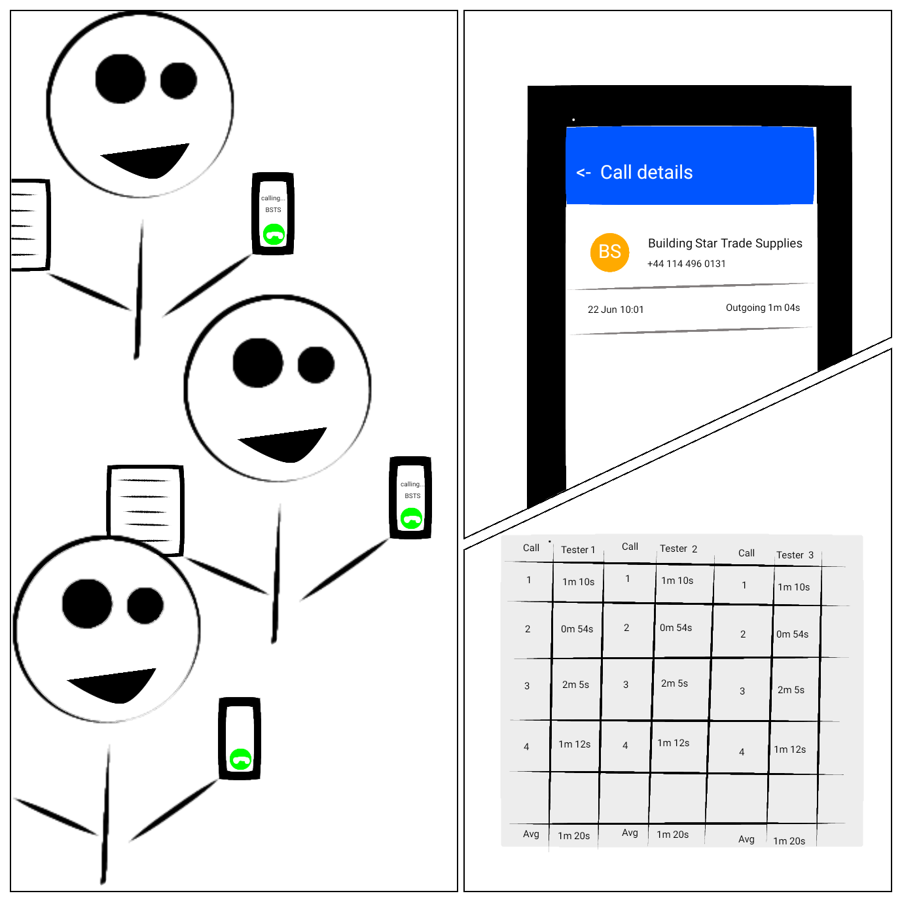

. Each tester is given their own phone and a list of orders to place

. The tester calls the new call center and places an order

. After the call terminates, the tester checks the phone screen to see how long the call took

. Call durations are logged for each order

. After all the testers have run through their list of dummy orders. The call times for all the testers are collated 

After reviewing the call logs, we found the average call duration was *36 seconds*. This within our SLA limit of 1 minute, *SHIP IT!*

=== Ship It!!

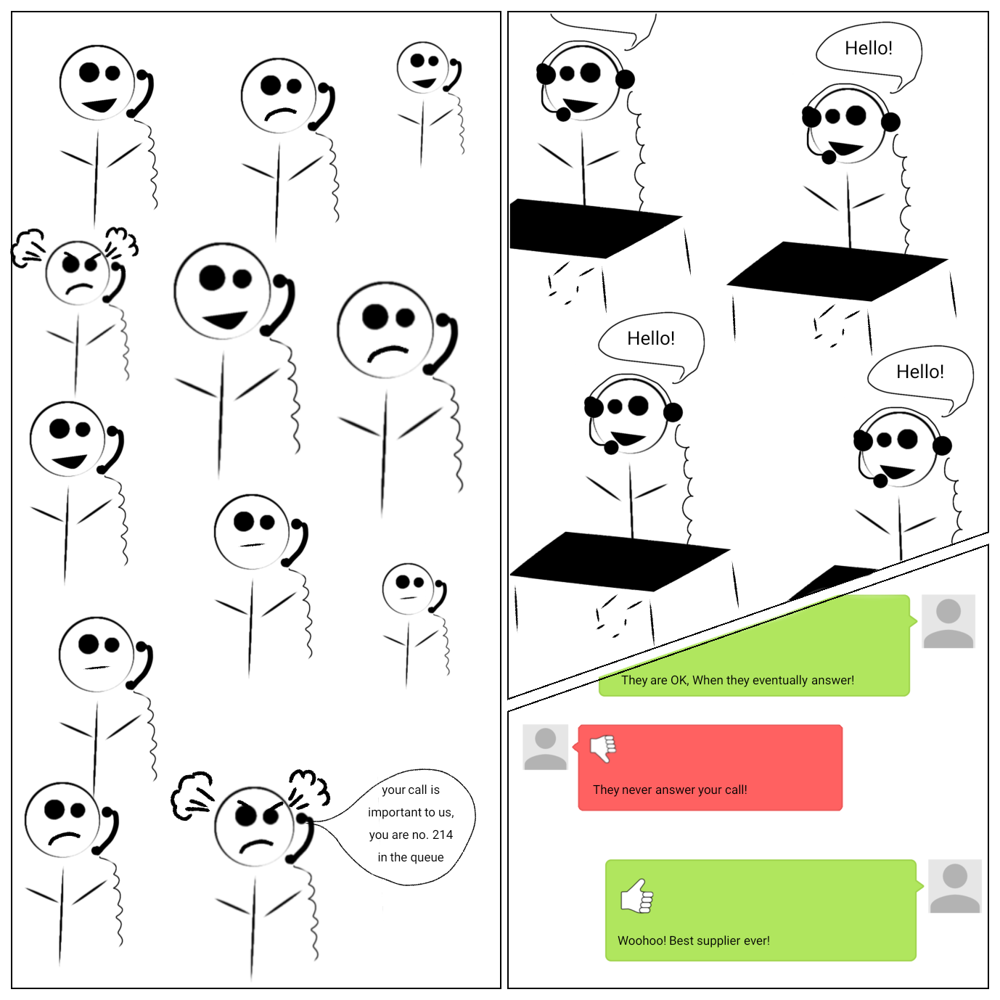

Fairly soon after opening *BSTSI-callHandler-2.0*, negative reviews start appearing.  Some people are frustrated that they can not quickly get through to place an order. And it is not just one person! there are a few disgruntled customers.

=== What went wrong?

*Our test had some fundamental flaws*. While everything appeared to provide us with the data to give us confidence about how the call center would perform, we were not quite modelling how calls would arrive *in the real world*.

Each tester had been given their own phone and a list of orders to place. This puts some limits on the test;
[IMPORTANT]
====
. *Testers can only place one order at a time!*

. *Testers are blocked* from placing any more orders until their current order is placed.  

. In the real world there are many more customers, *each with their own phone*

. In the real world, *customers enquiries arrive at different, random times, often in parallel*. 
====

In addition to to the test design problems above, in the real world there are *hiccups*.  For example, in our call center there are Lunch breaks, fire alarms, computer systems crash etc.

=== How does a Hiccup effect our call center performance?

We have our imaginary call center, now lets have an imaginary outage! 

[#img-dilbert-token-ring] 
.https://dilbert.com/strip/1996-05-02
[link=https://dilbert.com/strip/1996-05-02] 
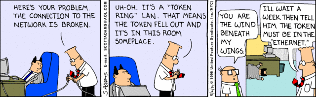

Someone in the server room has rolled over a network cable and accidentally severed it, finding a new cable and wiring the server back into the switch takes 10 mins. All the backend systems were out for 10 minutes, tying up the operators until the backend systems come back online.

=== Lets do some Math!

Lets make some assumptions about our imaginary call center, with its imaginary outage;

- testers will make *1,000 new orders*.
- we have *10 testers*.  
- the call center should be handling 20 calls per minutes (i.e. 2x 30s calls per tester). The *arrival rate is 20 calls per minute*
- the maximum call handle rate (max throughput) of the call center is 60 calls per minutes. I.e. the *maximum processing rate is 60 calls per minutes*
- any *backlog does not effect the service time* (in reality this is not true, but brevity we will making this assumption)
- our call center has a *10 minute hiccup* in the middle of the test.
- all calls are processed, the *dropout rate is 0*
- each order takes a deterministic *30 seconds* to complete. (*service time = 0.5min*)
- in the time before the outage, all calls are handled immediatley (*waiting time = 0min*)
- the queue is a First-In-First-Out (FIFO) queue
- the queue is infinitely sized

What does this do the to summary statistics? A 10 minute Hiccup _during our tests_ would have been observed like this by the *testers*;

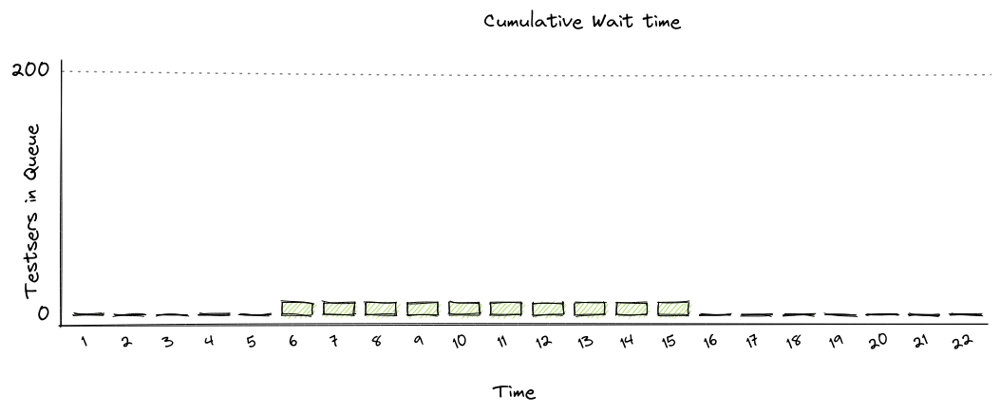

[NOTE]
====
The *Average Call Duration measured during Testing was 0.6 minutes (0min 36sec)*
====

Whereas, _in reality_, a 10 minutes Hiccup will be observed like this by our *customers*;

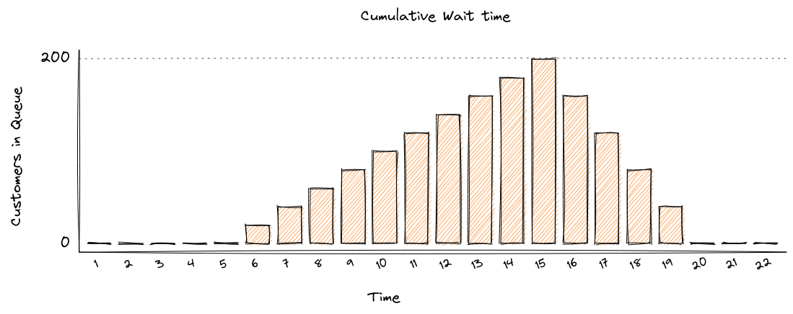

[NOTE]
====
The *Average Call Duration experienced by customers was 1.9 minutes (1min 54s)*
====

If you want to understand the math, please read <<Appendix A: Detailed Math>>

=== Why are the numbers so different?

[IMPORTANT]
====
In our testing scenario, there were 10 testers who were blocked for 10 minutes. In reality users would *keep calling the telephone line* and being put on hold until an operator became available.

*Our test captured 10 Testers blocked for 10 minutes, but in reality 200 users would have been waiting for up to 10 minutes. We did not captured the waiting time of 200 of our users!*

Our flawed test showed the average order time of 36 seconds, but on average customers would have waited 1minute 54 seconds.

*The MISSED waiting time was not included in the summary statistics!*
====

=== Second Attempt

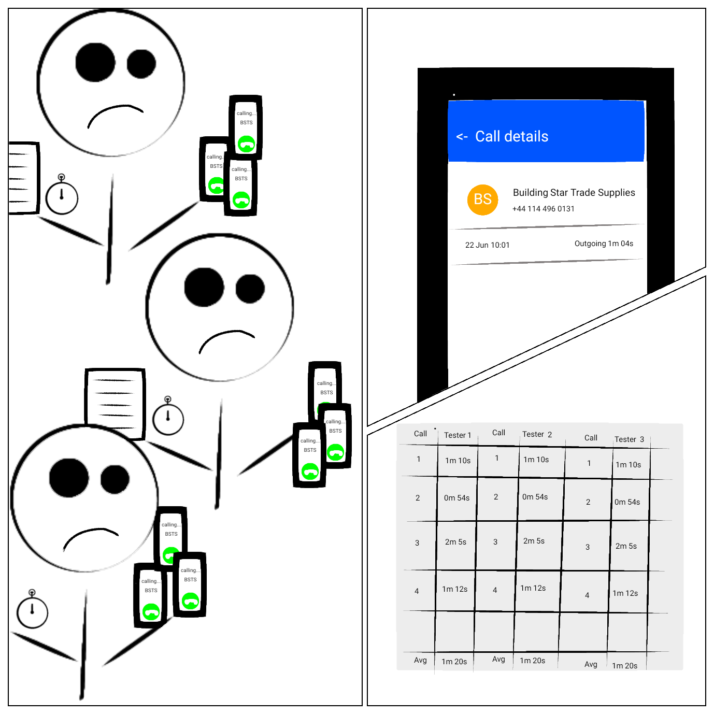

. Each tester is given *multiple phones*, a list of orders to place *and the time to start the call* and a *stopwatch*

. The tester(s) calls the call center to place orders, *at the time specified on their list*

. If the first call does not complete before the next order needs to be placed, the tester users a *different* phone to make the next call. Any one tester can have multiple calls *running concurrently* at the same time.

. After the call terminates, the tester checks the phone screen to see how the call took, and records this as the "Order Time"

. After all the testers have run through their list of dummy orders. The call times for all the testers are collated and summary data is calculated.

. If the tester runs out of phones, they start the stopwatch and stop the stopwatch again when one of their phones becomes available. After all of the orders have been placed, the stopwatch value is recorded the total *blocked time* for each tester during the load test.  *This is a direct measurement of Coordinated Omission.*

[WARNING]
====

This time the average call time was 1 minute 20 seconds, above our SLA.

We need to investigate why we are not meeting our SLA before rolling out *BSTSI-callHandler-2.0* to our customers

====

=== What is different?

Why is this a more accurate reflection of reality. A small number of testers are trying to mimic 1000 customer orders. In reality, we wouldn't have 10 customers, each placing 100 orders in sequence. We are more likely to receive 1000 different customers, each placing one order.  They would not arrive in sequence, but in parallel and at random times.

In the first test, the testers could only make one call and made the calls in sequence. The maximum queue size was the number of testers.  If there was a hiccup, they could not start a new call, but were blocked until they could end their current call.  The wait time of any other customers trying to call the call center was missed.  

In the second test, the testers could use multiple phones to place calls in parallel. By have a list of pre determined times, we define how many new customers calls were arriving at the call center. We can record the total call time for each virtual customer, and if we run out of phones (*connections*) to support the arrival rate, we record the blocked time.

[IMPORTANT]
====
If there is *any* blocked time recorded, the *results are invalid*.  It is invalid because we can no long queue any more customers, and record their wait time.
====

== Bringing it back to Benchmark Design

== What can be done?

A load generation tool that uses asynchronous I/O and uncouples threading from I/O, which measures timing independent on I/O is able to detect when the System Under Test is applying back-pressure to the load generator.

Tools such as https://hyperfoil.io/[Hyperfoil] will detect *and report* server back-pressure, so you *can* be sure that the load generator is reporting accurate response times without any Coordinated Omission effects from the SUT.

== How I tell if my load generation tool suffers from Coordinated Omission?

Luckily there is a very simple test you can do! `CTRL+Z`

While your benchmark is running, type `CTRL+Z` to Stop your process

[source,bash]
----
$ ./run_my_service.sh
^Z
[1]+  Stopped                 ./run_my_service.sh
----

After a period of time, start it again

[source,bash]
----
$ fg 1
./run_my_service.sh
----

[IMPORTANT]
====
If the load generator *only* reports N number of requests, equivalent to the number of threads configured to generate load, taking the `Stopped` period of time and no more threads experiencing delay then you have a problem
====

== See it in action

We covered a demonstration of Coordinated Omission in "Quarkus Insights #22: Performance Testing: Tips and Pitfalls"

++++

<iframe width="560" height="315" src="https://www.youtube.com/embed/xdG8b9iDYbE?start=1500" title="YouTube video player" frameborder="0" allow="accelerometer; autoplay; clipboard-write; encrypted-media; gyroscope; picture-in-picture" allowfullscreen></iframe>

++++

== Can tune away this problem?

=== What happens if I increase the number of threads?

Unfortunately not, you *might* be able to mitigate some of the issues through tuning, but you can *never be certain that the results are accurate*. The fundamental problem is that there is *missing data*, but you can not tell from the results if all the data has been captured.

Statements are often made such as _'As with any Load Testing tool, if you don't correctly size the number of threads, you will face the "Coordinated Omission" problem which can give you wrong or inaccurate results.'_ (https://jmeter.apache.org/usermanual/best-practices.html)

The fundamental issue is not with the _size of the thread pool_, but whether the load generator threads that measure response time _can be blocked by the System Under Test_.  

=== Can't I just run the tests for longer?

How many hiccups does your system have? How long do they last? Even if you can quantify those metrics, adjusting adding wait time to response times through a different data source is error prone. You might as well pick a load generation tool that handles coordinated omission and not have to normalize for a broken methodology.

=== My application does not stop that long, surely this is effect negligible?

I have personally witnessed applications under load fully paused for 2-3 seconds to perform GC, every 5-10 seconds.  Unless your load generator can measure that wait time, *you will not know* that the application was stalled. a load generator that suffers from co-rdinated omission has no way of measuring it

=== Can't I just look at the summary stats to tell if my run was affected?

It is very difficult! The maximum values will be the same. The mean and centile response times look sensible.  The only way to tell is if the requests sent are equal to expected number of requests to be sent during the time period. However, if you can not set an arrival rate, it is not possible to determine if the expected number of requests were sent.

[IMPORTANT]
====
*If the load generation tool does not decouple time measurement from generating load, the problem can not be tuned away.*
====

== Summary

Coordinated Omission is the unintended back pressure a system under test can apply to a load generation tool, that prevents that tool for accurately recording user experience.  

*Response time* = *wait time* + *service time*.  A load generation tool that suffers from coordinated omission will only record *service time* and will fail to record *wait time*.  Wait time *can be significant* and therefore can have a huge effect on summary statistics. 

The worst part is, the load generator is unable to record the missed time, so users are completely unaware that there is a problem.

In order to design response time tests (typically associated with SLA's) we need to use tools that accurately record response time, including wait time.  More importantly, our tools should *warn us if there is any unintended back-pressure from the System Under Test*.

Choosing a tool such as https://hyperfoil.io/[Hyperfoil] will not only provide you with accurate measurements, it will also warn you and fail the benchmark if it detects hiccups that have effected the accuracy of the results.

'''

== Further Reading

For more information, please visit the following articles;

- http://highscalability.com/blog/2015/10/5/your-load-generator-is-probably-lying-to-you-take-the-red-pi.html

'''

== Appendix A: Detailed Math

=== In our test scenario

we had *10 testers* placing orders each placing an order. At 6 mins there was an outage, that *lasted 10 minutes*.

Therefore, for 10 blocked orders;

- there was a *wait time of 10 minutes each*
- there was a *service time of 0.5 mins*
- total *order time was 10.5 minutes*

For the remaining 990 orders;

- there was a *wait time of 0 minutes each*
- there was a *service time of 0.5 mins*
- total *order time was 0.5 minutes*

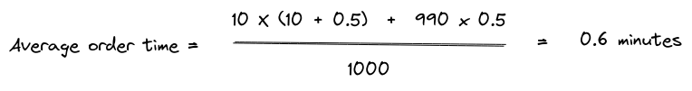

[NOTE]
====
The *Average Call Duration measured during Testing was 0.6 minutes*
====

=== In the Real World

Things are a bit more complicated;

- new customers arrive at a rate of *20 per minute*
- therefore, during the first minute of outage, 20 customers will be placed in the switchboard queue and will have to wait for *10 minutes*, before the queue starts to empty
- in the 2nd minute of the outage *another 20 customer* arrive, are placed in the switchboard queue and will have to wait for *9 minutes*, before the queue starts to empty
- customers continue to arrive during the outage, filling up the switchboard queue
- *once the outage is resolved* the operators can start to process the queue of customers. But there is a maximum number of customers they can process in one minutes (60 customers per minute *max throughput*)
- while the backlog is being processed at a rate of *60 customers per minute*, *20 customers per minute* are still being added to the back of the queue.

During the outage, the total *Wait time* can be modelled by; 

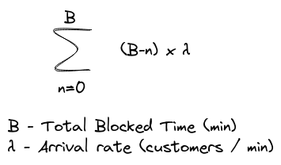

After the outage, while the backlog is cleared, the total *Wait time* can be modelled by;

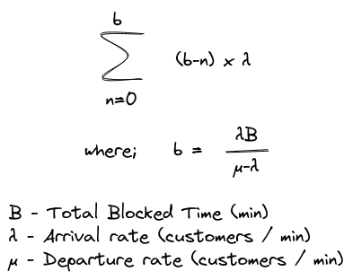

If we calculate our scenario;

image::realAvWaitTime.png[Real Average Order time,,float="right",align="center"]

[NOTE]
====
The *Average call duration _experienced_ by customers was 1.9 minutes!*
====
