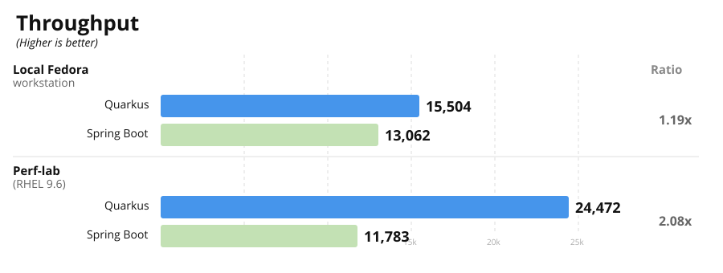
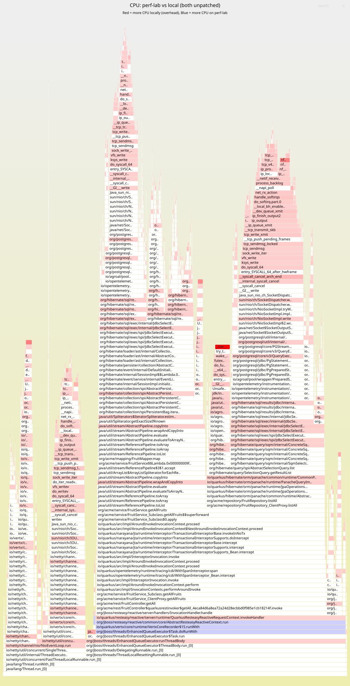
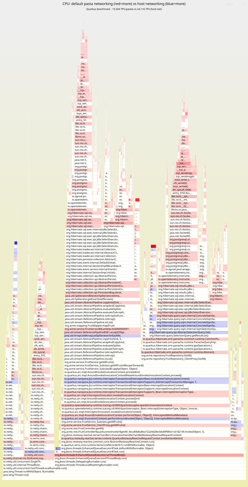

A community member ran our https://github.com/quarkusio/spring-quarkus-perf-comparison[Quarkus vs Spring CRUD benchmark] on their bare-metal Fedora workstation and asked:

[quote]
____
[.lead]
_Why do I see only 1.19x instead of 2x?_
____

**Our perf-lab shows Quarkus at 2.08x Spring's throughput, but locally the gap nearly disappears.**

This post walks through the investigation that found the culprit.

== The gap

The benchmark is a REST/CRUD application backed by PostgreSQL. The app runs on the host, postgres in a rootless podman container. Each HTTP request executes 2 SQL queries (confirmed via https://www.postgresql.org/docs/current/pgstatstatements.html[pg_stat_statements]).

Spring delivers roughly the same throughput in both environments (~12-13K TPS). Quarkus swings from 15.5K to 24.5K -- it is being held back locally. **Something between the app and postgres is penalizing Quarkus specifically.**

== mpstat: where is the CPU going?

The benchmark collects https://man7.org/linux/man-pages/man1/mpstat.1.html[mpstat] data during every run — per-CPU utilization split into `%usr` (application code), `%sys` (kernel), `%soft` (softirq, mainly network packet processing), and `%idle`. This is part of our https://github.com/quarkusio/spring-quarkus-perf-comparison/issues/62[active benchmarking practice]: observing the system _while it runs_, not just collecting final TPS numbers.

Both environments run Quarkus at 2.3GHz with the same workload and CPU pinning. The mpstat profiles could not be more different:

[cols="2,1,1,1,1", options="header"]
|===
| Environment | %usr | %sys | %soft | %idle

| Local (Fedora, 15,504 TPS) | 39-50% | 34-41% | 9-17% | 3-5%
| Perf-lab (RHEL, 24,472 TPS) | 87-94% | 5-11% | 0-2% | 0%
|===

`%usr` is time running application code. `%sys` is time in the kernel. On perf-lab, over 85% of CPU goes to the application. Locally, nearly half goes to the kernel — and the application has idle CPU it cannot use. Same application, same clock speed, same workload: **the local environment is burning CPU in the kernel instead of running the app.**

== Where is the kernel time going?

A https://www.brendangregg.com/flamegraphs.html[differential flamegraph] of the JFR CPU profiles (collected via https://github.com/async-profiler/async-profiler[async-profiler]) from the perf-lab and local Quarkus runs shows exactly where the extra kernel time is spent:

Red frames appear more in the local run; blue frames appear more on the perf-lab. The brightest red hotspots are kernel spin locks (`_raw_spin_unlock_irqrestore`), nftables firewall evaluation (`nft_do_chain`, `nft_meta_get_eval`), and TCP packet processing (`tcp_clean_rtx_queue`, `skb_defer_free_flush`). The blue band at the bottom is application code that gets more CPU on the perf-lab — because the kernel isn't eating it. **The local kernel is spending cycles on network packet processing and firewall rules that the perf-lab doesn't need.**

== Isolating the network layer with pgbench

To confirm the network path was the bottleneck, we ran https://www.postgresql.org/docs/current/pgbench.html[pgbench] with the same 2-query workload (50 clients, prepared statements, 30 seconds) over different network paths. We also tested with Fedora's https://wiki.nftables.org/[nftables] firewall disabled, since the flamegraph showed `nft_do_chain` in the kernel stacks:

[cols="2,1,1", options="header"]
|===
| Network path | TPS | Stmt latency

| Host -> container (pasta + nftables) | 18,106 | 1.38ms
| Host -> container (pasta, no nftables) | 20,402 | 1.22ms
| Host -> container (`--network=host`) | 53,262 | 0.47ms
|===

With `--network=host`, statement latency drops from 1.38ms to 0.47ms — a 3x reduction. With 2 statements per HTTP request, that overhead adds up on every request.

== Root cause: pasta, the userspace TCP proxy

Rootless podman on Fedora uses https://passt.top/passt/[pasta (passt)] to forward container ports. Unlike rootful podman (which uses kernel-level port forwarding), pasta is a userspace process that proxies every TCP packet:

----
With pasta (default rootless):
  App  -->  kernel  -->  pasta (userspace)  -->  kernel  -->  container netns  -->  postgres

With --network=host:
  App  -->  kernel  -->  postgres (same network namespace)
----

Every JDBC packet traverses two extra kernel/userspace boundary crossings plus a userspace copy in the pasta process. For a chatty protocol like JDBC with small, frequent packets, this is devastating.

=== Bonus: nftables firewall overhead

Fedora's `firewalld` maintains 973 https://wiki.nftables.org/[nftables] rules that every packet traverses (`nf_hook_slow` -> `nft_do_chain`). This is independent of pasta — it affects any network traffic on the host. Disabling the firewall recovers another ~10% throughput. This matches findings from https://talawah.io/blog/extreme-http-performance-tuning-one-point-two-million/[prior work on extreme HTTP tuning] where iptables `nf_hook_slow` consumed ~18% of CPU in benchmarks.

== Why Quarkus is affected but Spring is not

[cols="2,1,1,1", options="header"]
|===
| Configuration | Quarkus TPS | Spring TPS | Ratio

| Default (pasta + nftables) | 15,504 | 13,062 | 1.19x
| `--network=host` | 24,116 | 13,368 | 1.80x
| Perf-lab (RHEL 9.6) | 24,472 | 11,783 | 2.08x
|===

Removing pasta boosts Quarkus by 55% but Spring by only 2.3%. **The reason is where each framework spends its CPU time.**

**Quarkus is I/O-efficient**: its per-request framework overhead is small, so DB round-trip latency dominates the profile. When pasta adds 0.9ms per statement, that overhead becomes a large fraction of Quarkus's total per-request cost. Remove pasta, and Quarkus unlocks all the CPU it was wasting on proxy overhead.

**Spring is CPU-bound on framework overhead**: deeper call stacks and more instructions per request mean DB latency is a smaller fraction of Spring's per-request cost. Removing pasta barely moves the needle.

In other words, **pasta was masking Quarkus's I/O efficiency advantage** -- the very thing that makes it 2x faster on the perf-lab.

== The fix

Run the postgres container with `--network=host` instead of port-mapping (`-p 5432:5432`). We added `DB_HOST_NETWORK=true` to the benchmark's https://github.com/quarkusio/spring-quarkus-perf-comparison/blob/main/scripts/infra.sh[infrastructure script].

[cols="2,1,1,1", options="header"]
|===
| Configuration | Quarkus TPS | vs Perf-lab | Ratio Q/S

| Default (pasta + nftables) | 15,504 | 63.4% | 1.19x
| No nftables only | 16,105 | 65.8% | --
| `--network=host` | 24,116 | 98.5% | 1.80x
| `--network=host` + no nftables | 26,039 | 106.4% | --
| Perf-lab (RHEL 9.6) | 24,472 | 100% | 2.08x
|===

**With host networking, the local Fedora workstation matches the perf-lab.** The remaining gap to the perf-lab's 2.08x ratio is accounted for by nftables (Fedora's 973 rules vs RHEL's minimal ruleset) and minor kernel differences.

Per-request CPU cost confirms the picture:

[cols="2,1", options="header"]
|===
| Configuration | CPU ms/req

| Default pasta (15,504 TPS) | 0.231
| Host networking (24,116 TPS) | 0.158
| Perf-lab (24,472 TPS) | 0.158
|===

With host networking, per-request cost **matches the perf-lab exactly**: 0.158 ms/req.

== Confirming the fix

A second differential flamegraph — this time comparing the local default (pasta) run with the local `--network=host` run — confirms the overhead is gone:

Red means more CPU in the default (pasta) run; blue means more CPU with host networking. The red stacks that dominated the first flamegraph — `_raw_spin_unlock_irqrestore`, `nft_do_chain`, `tcp_clean_rtx_queue` — have disappeared.

**With `--network=host`, the app and postgres share the same network namespace; packets never leave the kernel.**

== Takeaways

* **A benchmark that doesn't stress what it claims to stress will deliver misleading results.** This is a textbook case of what Brendan Gregg calls https://www.brendangregg.com/activebenchmarking.html[active benchmarking]:
+
[quote, Brendan Gregg]
____
_You benchmark A, but actually measure B, and conclude you've measured C._
____
+
We thought we were measuring framework throughput, but we were actually measuring pasta proxy overhead. Only by observing the system _while the benchmark was running_ — https://man7.org/linux/man-pages/man1/mpstat.1.html[mpstat], pgbench, flamegraphs, as https://github.com/quarkusio/spring-quarkus-perf-comparison/issues/62[required by our benchmarking practice] — did the real bottleneck emerge. The https://quarkus.io/blog/new-benchmarks/[published benchmark] was designed to isolate framework performance from infrastructure variables -- but rootless container networking silently violated that isolation.

* **The impact is asymmetric.** I/O-efficient frameworks like Quarkus are disproportionately penalized because DB latency is a larger fraction of their per-request cost. CPU-bound frameworks like Spring are barely affected, which compresses the apparent gap.

* **Check your networking path.** Run `podman info | grep rootlessNetworkCmd` to see your backend. If it says `pasta` and your benchmark talks to a containerized database, use `--network=host` for the database container.

* **Firewall rules add up.** Nearly 1000 nftables rules cost ~10% throughput on a chatty workload. For benchmarking, consider temporarily disabling the firewall or using a minimal ruleset.

== Known upstream issues

Our findings are consistent with several known issues in the podman/pasta ecosystem:

* **pasta is single-threaded by design** and degrades above ~8 concurrent connections. At higher concurrency, even the older slirp4netns backend can outperform it. (https://github.com/containers/podman/discussions/22559[Podman Discussion #22559])

* **pasta consuming 90-100% CPU** has been reported under sustained network load, e.g. Wireguard tunnels on kernel 6.x. (https://github.com/containers/podman/issues/23686[Podman Issue #23686])

* **Java + PostgreSQL hang** -- a Spring app running PostgreSQL `COPY FROM STDIN` via pasta consistently freezes mid-transfer. `--network=host` fixes it. (https://github.com/containers/podman/issues/22593[Podman Issue #22593])

* **Throughput far below host capacity** -- rootless containers on multi-gigabit hosts achieving only ~100 Mbit/s through pasta. (https://github.com/containers/podman/issues/17865[Podman Issue #17865])

* **Traffic stalls under sustained load** -- TCP downloads through pasta start normally then halt, with pasta pinned at high CPU. (https://github.com/containers/podman/issues/17703[Podman Issue #17703])

* The official https://github.com/containers/podman/blob/main/docs/tutorials/performance.md[Podman performance tutorial] documents `--network=host` and socket activation as workarounds for network-sensitive workloads.
