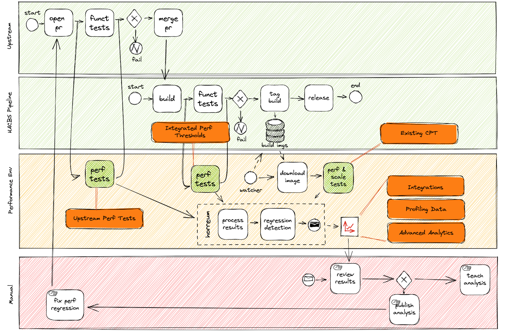

= Shift Left on Performance
:icons: font

Performance testing is often a major bottleneck in the productization of software. Performance tests are normally ran late in the development lifecyle, require a lot of manual intervetion and regressions are detected often after a long bake time.  

Shifting from versioned products to continual delivered services requires a shift in paradigms for managing performance testing.

== Problem Statement

How can do performance engineering teams enable Eng / QE / SRE to integrate Performance Testing into their workflows, to reduce the risk that performance regressions propagate through to production managed services?

== Typical Product Workflow 

A typical "boxed product" productization workflow can be represented by; 

The key issues that this type fo workflow has is;

* There is a break in continuity between tag build and release stages of the CI Build pipeline
* Development, build and performance testing are performed by different teams, each passing *async* messages between teams
* The feedback loop to developers is manual and slow
* There is a lot of manual analysis performed, often with ad-hoc data capture and reporting

The above scenerio generally develops due to a number of factors;

* Dedicated performance environments are costly and difficult to setup and manage
* Performance Analysis (including system performance monitoring and anlaysis) is generally a specialized role, concentrateed in small teams
* The time required to manage reliable/accurate benchmarks is often a time sink 

'''

=== Whats the problem?

The later in the development and release cycle performance testsing occurs, the more costly it is to fix performance bugs.

Over the years, methodologies have developed to allow functional tests to be performed earlier in the development lifecyle, reducing the time between functional regressions being introduced and discovered. 

This has the benfits of;

* Push earlier into development cycle
* Discover quality issues more quickly
* Reduce cost to fix
* Reduce test & deploy cycles

'''

=== What does it mean to Shift left?

==== In the traditional waterfall development model

In the traditional Waterfall model for software development, shift left means pushing tests earlier into the development cycle;

==== In the Agile world

For continually delivered services, shiftling left incudes a further dimension;

== Risks in the managed service world

[IMPORTANT] 
==== 
Multiple, Rapid dev cycles

Probability of releasing a product with a performance regression increased

Performance Regressions will effect *All* customers, *Immediately*
====

'''

== Performance Shift-Left Workflow

In a "Shifted-left" model;

* *Repository Bots* allow performance engineers to initiate performance tests against open Pull Requests
* *Integrated Performance Threshold* tests provide automated gating of acceptable levels of performance
* *Continual Performance Testing* allows for analysing trends over time, scaling, soak and choas type testing
* *Automated Regression Detection* provides automated tooling for detecting catastorphic performance regression related to a single commit, or creeps in performance degredation over time

Continual analysis is performed by experienced engineers, but the process does not require manual intervention with each release.

Engineers are free to 

== Repository Bots

INFORMATION:: 
Repository Bots initiate performance tests against PR's. Their purpose is to allow Engineers to make a decision on whether to merge a PR or not. The results need to be actionable by engineers. Profiling data should also be provide to allow engineers to understand what their changes are doing

Recieve report & analysis of impact of changes to key performance metrics

Allow automated capture of profiling data of system under load, allowing engineers to *see* what thier changes are doing under realistic scenarios

* Triggered from CI/CD pipeline
* Automatic / Manual
* Performance Results reported in PR
* Actionable data for Engs (results/profiles)

== Integrated Performance Thresholds

INFORMATION:: 
The aim of Integrated Performance Tests is to determine whether a release mets acceptable levels of performance with respect to customer expectations, not to capture changes over time. The results need to be automatically calculated and should provide a boolean Pass/Fail result.

* Pass/Fail criteria - the same as functional tests, the performance should be either be acceptable, or not-acceptable
* Fully automated - not manual intervetion / analysis
* Focused on user experience
* Threshold based?
* Integrated with QE tools
* Portable Tests
* Limits Thresholds defined by CPT

== Continual Performance Testing

INFORMATION:: 
The aim of Continual Performance Testing is to perform larger scale performance workloads, that can take time to perform.

These tests can include;

* Large scale end-to-end testing
* Soak tests
* Chaos Testing
* Trend analysis
* Scale testing
* Automated tuning of enviroment
* Detailed profiling and analysis work

== Automatic Change Detection

Automated tools that allow detection of changes in key performance metrics over time 

== Integration with Analytical Tools

== Cotinual Profiling & Monitoring

