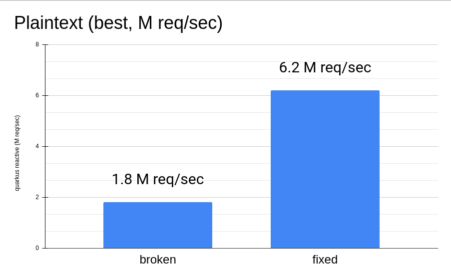

This article is a detailed and complementary content to *Quarkus Insights #107: Quarkus Runtime performance - a peek into JVM internals*:
++++

<iframe width="560" height="315" src="https://www.youtube.com/embed/G40VfIsnCdo" title="YouTube video player" frameborder="0" allow="accelerometer; autoplay; clipboard-write; encrypted-media; gyroscope; picture-in-picture" allowfullscreen></iframe>

++++
This episode treats a breed of issues caused by the scary (was registered at Halloween on purpose) JDK issue; https://bugs.openjdk.org/browse/JDK-8180450["JDK-8180450: secondary_super_cache does not scale well"]
that can causes massive performance degradation on several middleware frameworks e.g. Netty, Vert-x, Mutiny, Hibernate, Quarkus...

== What's JDK-8180450?

For those who haven't yet watched https://youtu.be/G40VfIsnCdo[Quarkus Insights #107], `JDK-8180450` is a severe scalability penalty happening while
performing type checks (`instanceof`, `checkcast` and similar) against interfaces (so-called secondary super types).

This scalability issue is triggered by massive concurrent updates to `Klass::_secondary_super_cache`
from multiple threads, which in turn causes https://en.wikipedia.org/wiki/False_sharing[False Sharing] with its surrounding fields eg `Klass::_secondary_supers`.

This https://github.com/openjdk/jdk11/blob/37115c8ea4aff13a8148ee2b8832b20888a5d880/src/hotspot/share/oops/klass.hpp#L133[JDK 11 snippet] shows both fields and
what they are used for:


class Klass : public Metadata {
  // ...
  // Cache of last observed secondary supertype
  Klass*      _secondary_super_cache;
  // Array of all secondary supertypes
  Array<Klass*>* _secondary_supers;
  // ...


To make it more concrete: 

* https://docs.oracle.com/en/java/javase/11/docs/api/java.base/java/lang/Integer.html[`Integer`] 's implement both `Comparable` and `Serializable`
* `_secondary_supers` contains both `Comparable` and `Serializable`, 
* `_secondary_super_cache` is used byt he JVM like this:

    Object o = new Integer(1);
    // _seconday_super_cache is empty
    // search Comparable on [ Comparable, Serializable ]
    if (o instanceof Comparable) {
        // _seconday_super_cache := Comparable -> cache HIT!
        useComparable((Comparable) o);
    }

The JVM does not need to search for `Comparable` in the `_secondary_supers` array when evaluating `checkcast` in the `useComparable`, instead it can
use the `_secondary_super_cache` field, saving useless work.

So, *What causes massive amounts of updates to the cache field*?

The answer is simpler then it seems: making it ping-pong between multiple values contained in `_secondary_supers`!

The code below shows an example of this dangerous code pattern:

    // o.getClass() == Integer.class
    public static void compareAndSerialize(Object o) {
        if (o instanceof Comparable) {
            // _seconday_super_cache := Comparable
            useComparable((Comparable) o);
        }
        if (o instanceof Serializable) {
            // _seconday_super_cache := Serializable
            useSerializable((Serializable) o);
        }
    }

The comments in the code show what happens if this method is called by a single thread, causing two `_secondary_super_cache`
invalidations for every `compareAndSerializable` method execution, but

*What happens if there are more than one thread*?

`Integer::_secondary_super_cache` is shared among all threads, leading to an increased chance to invalidate it at *every type check* (including `checkcast` 's on `useComparable`/`useSerializable`!).

== Why's that scary?

As mentioned on https://youtu.be/G40VfIsnCdo[Quarkus Insights #107], the Red Hat Middleware Team uses different versions of
https://www.techempower.com/[Techempower Benchmark] to validate https://quarkus.io[Quarkus]'s performance regressions.
Hitting such scalability bottleneck in our lab has caused a performance degradation quite significant while running on our `Intel(R) Xeon(R) Gold 5218 CPU` with 64 logical cores (32 without Hyper-Threading, splitted in 2 https://en.wikipedia.org/wiki/Non-uniform_memory_access[NUMA] nodes):

But what about running the same test with just 2 cores?

image::2_cores.png[2 cores plaintext results]

As shown, even with few cores, if the mentioned bad code pattern is hit in the hot path, the effects are still dramatic!

=== A stealthy performance killer!

The scariest part has yet to come: what we discovered while investigating the https://github.com/netty/netty/issues/12708[most severe case]
affecting our Quarkus results, is that "traditional" Java profiling tools didn't seem to help diagnosing it
(eg https://access.redhat.com/documentation/en-us/openjdk/11/html/using_jdk_flight_recorder_with_openjdk/index[Java Flight Recorder], https://github.com/jvm-profiling-tools/async-profiler[Async Profiler]).
Furthermore, a few weeks after the Quarkus Insights recording, Netflix has published an https://netflixtechblog.com/seeing-through-hardware-counters-a-journey-to-threefold-performance-increase-2721924a2822[article]
highlighting the same problem while using traditional Java Profilers.

Specifically, https://access.redhat.com/documentation/en-us/openjdk/11/html/using_jdk_flight_recorder_with_openjdk/index[Java Flight Recorder] wasn't reporting
any guilty stack trace pointing to the source of the issue, while https://github.com/jvm-profiling-tools/async-profiler[Async Profiler] was reporting
broken stack traces (with the right cost/samples count). In both cases the bad code pattern was unnoticed, although
the latter provided some hint that something incorrect was occurring.

In the above https://netflixtechblog.com/java-in-flames-e763b3d32166[flamegraph], the bottom left of the graph shows
some costy methods, but failing to report the correct methods: not useful to fix it!

We've further investigated and discovered (thanks to https://developers.redhat.com/author/andrew-dinn[Andrew Dinn] and Andrei Pangin,
https://github.com/jvm-profiling-tools/async-profiler[async profiler]'s author ) that the JFR mechanism to
collect stack traces (implemented on the JDK's as http://psy-lob-saw.blogspot.com/2016/06/the-pros-and-cons-of-agct.html[AsyncGetCallTrace])
isn't able to collect meaningful stack traces due to the
https://github.com/openjdk/jdk11/blob/37115c8ea4aff13a8148ee2b8832b20888a5d880/src/hotspot/cpu/x86/macroAssembler_x86.cpp#L5486[JDK's type check code],
which modifies the stack size and by consequence the x86 register used to track the https://en.wikipedia.org/wiki/Stack_register[Stack Pointer]
and key to determine the sampled calling method (more on this https://github.com/jvm-profiling-tools/async-profiler/issues/673#issuecomment-1304504745[Async Profiler issue's comment]).

Thanks to this investigation, a recent https://bugs.openjdk.org/browse/JDK-8287425[JDK change] fixing the mentioned behaviour
(which has been https://github.com/openjdk/jdk11u-dev/pull/1524[back-ported to JDK 11]) ,
making this issue more easily spotted with existing (`AsyncGetCallTrace`-based) Java Profilers: a proper "Community Happy End".

==== ...and False Sharing?

In addition to the above issue, https://en.wikipedia.org/wiki/False_sharing[False Sharing] is further confuses profiling tools.

For every invalidation of `Klass::_secondary_super_cache`, a search over `Klass::_secondary_supers` is performed,
causing a severe penalty (if stored in the same cache-line of the "noisy" field) and impacting other innocent code paths too:


    // o.getClass() == Integer.class
    // _secondary_super_cache always != CharSequence
    // slow path search on _secondary_supers := [ Comparable, Serializable ]
    if (o instanceof CharSequence) {
        // never happen
    } else {
        // always happen
    }

The snippet above shows that performing a type check for a non-implemented interface always
causes the JVM to perform a slow path search over `_secondary_supers`. This in turn forces loading the related field and causes
a ping-pong of cache coherency traffic. This has the effect of slowing down the innocent load instruction and causes a profiler
to highlight it as a cpu bottlneck.

The issue is detailed in this https://youtu.be/G40VfIsnCdo?t=1411[Quarkus Insights part]

=== OpenJDK compiler is (too) good

Some noticeable optimization strategies of OpenJDK are:

* https://wiki.openjdk.org/display/HotSpot/Inlining[Inlining]
* https://wiki.openjdk.org/display/HotSpot/TypeProfile[Type Profile]

Thanks to both optimizations, the JDK Compiler can drop type-check operations preventing the issue from happening.
Unlucky runtime conditions can then cause such optimizations to fail (as mentioned in https://youtu.be/G40VfIsnCdo?t=1692[this Quarkus Insights part]),
unexpectedly biting end-users (and real use cases).

This smart compiler behaviour, together with the previous mentioned profiler issues, has meant this issue has lay dormant and unnoticed for some time,
especially in benchmarking environments, where overly simplistic use cases were leaving the compiler more
room to optimize and hide it.

== What's next?
In order to support our developers and the Java Community to diagnose this stealthy and severe performance issue,
we've developed a https://github.com/raphw/byte-buddy[ByteBuddy]-powered https://github.com/RedHatPerf/type-pollution-agent[Java Agent]. This has helped fix the
most severe https://bugs.openjdk.org/browse/JDK-8180450?focusedCommentId=14536886&page=com.atlassian.jira.plugin.system.issuetabpanels%3Acomment-tabpanel#comment-14536886[code paths] of our products
(and the widely used https://github.com/netty/netty/issues/12708[Netty Framework]) and hopefully will be used by other
players of the Java Community to diagnose if their code can be affected by it.

Thanks to the reports of our developers and the rest of Java Community (including Netflix and Intel engineers),
the https://bugs.openjdk.org/browse/JDK-8180450[scalability JDK issue] now has raised a priority and a fix will be targeted for the Java 21 release.

As a separate effort we've evaluated with the OpenJDK Red Hat team alternatives fixes to the infamous JDK issue as well, ending up rejecting ad-hoc flags to disable such optimization (as it was designed to be)
because too harmful for existing users, which unconsciously have benefited from it till now. We are trusty that our feedbacks
will help making a better decision for the Java Community, present and future.

=== Is it still worthy to fix our code?

As usual: *Depends(TM)*.

As mentioned in Quarkus Insights, some fixes have helped to use different and more idiomatic code
solutions to replace the misuse (often abuse) of the existing type check-based logic, often leading to better performance and,
moreover, way better code.

In addition, there isn't yet (at the time this article has been published) any mention of back-porting plans,
meaning that legacy or just slow adopters (and existing users too) will be left behind, running code with suboptimal (at best) performance.

=== but I don't know yet how to use the Agent!

In the next articles of our blog we'll present more concrete examples of fixed code using
https://github.com/RedHatPerf/type-pollution-agent[the agent] (presented on this https://youtu.be/G40VfIsnCdo?t=2235[Quarkus Insights part] too)
and the impact of the OpenJDK compiler optimization strategies (briefly mentioned <<_openjdk_compilers_are_too_good,here>>).

== Special Thanks
====
* Andrew Haley
* Andrew Dinn
* Rafael Winterhalter
* Sanne Grinovero
* Norman Maurer
* Andrei Pangin
* Johannes Bechberger
* Quarkus, Hibernate, Vert-x, Mutiny and Infinispan teams for the patience and the efforts to try the agent and fix our products trusting our tools
* Netflix & Intel team and their https://netflixtechblog.com/seeing-through-hardware-counters-a-journey-to-threefold-performance-increase-2721924a2822[awesome article]
mentioned in <<_a_stealthy_performance_killer,this>> section
====

