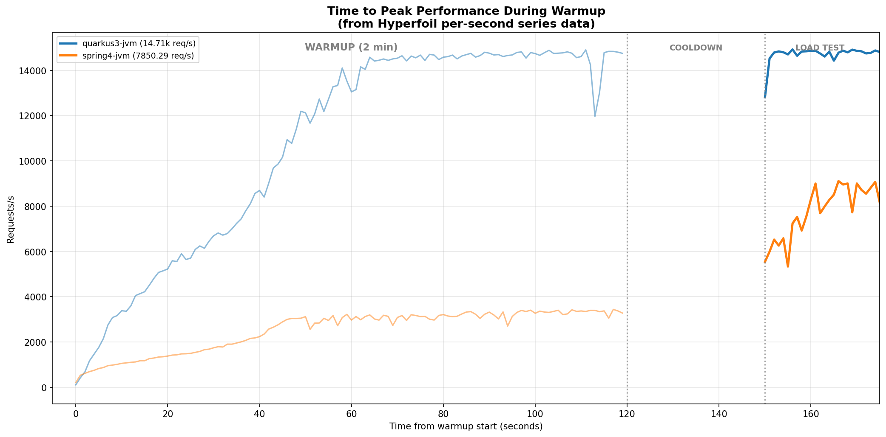
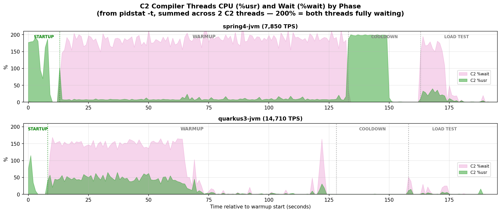
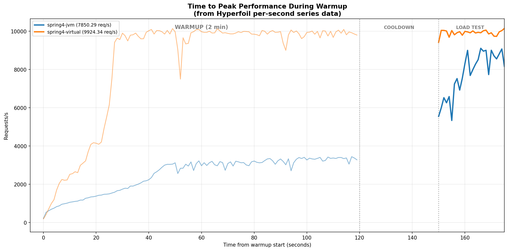
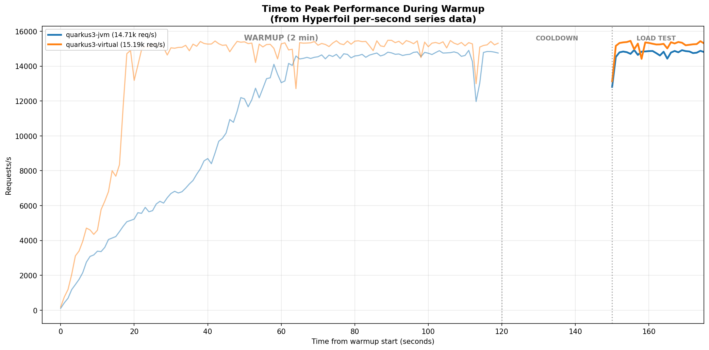
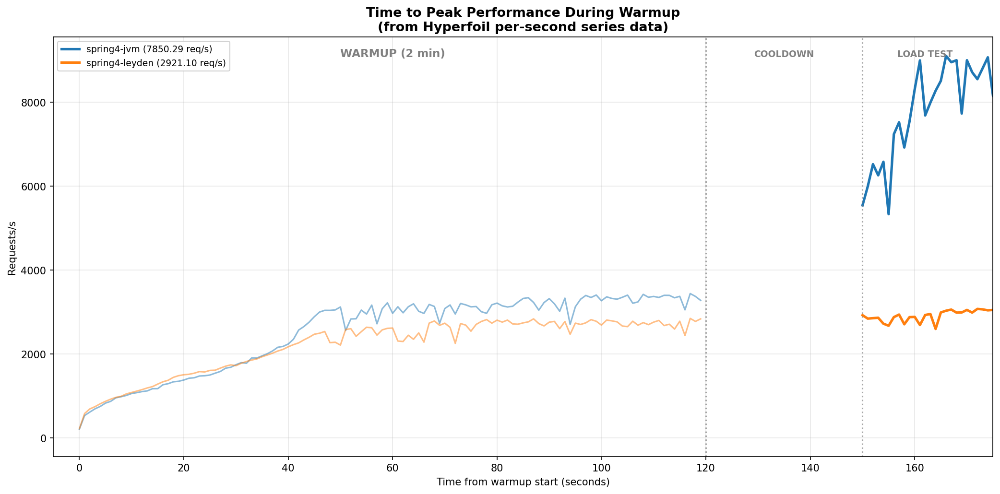
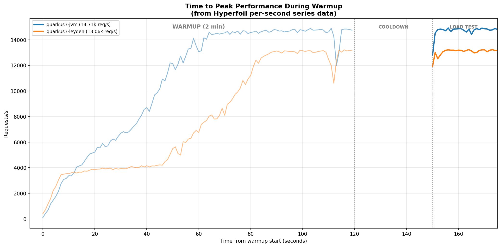
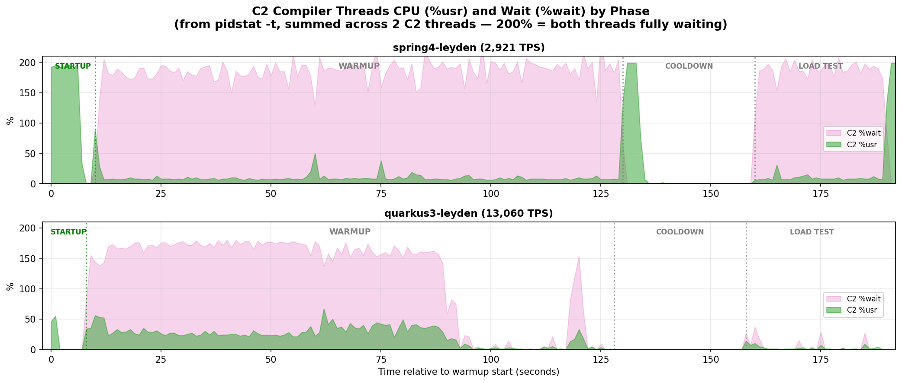

_https://www.youtube.com/watch?v=gAjR4_CbPpQ[Daft Punk]_

Our https://github.com/quarkusio/spring-quarkus-perf-comparison/tree/38345ca[Quarkus vs Spring CRUD benchmark] shows Quarkus delivering roughly 2x Spring's throughput on a REST/CRUD workload backed by PostgreSQL. The latest https://github.com/quarkusio/benchmarks/commit/d26d45d[public results] confirm this.

But throughput is an average over a measurement window. It doesn't tell you how long the application took to get there. This post looks at the dimension averages hide: **time to peak performance**.

The benchmark runs on our RHEL 9.6 performance lab with JDK 25, 4 pinned cores per application, and 100 concurrent HTTP connections. Each run consists of a **2-minute warmup** at full load, a **30-second cooldown**, and a **30-second load test** where throughput is measured.

== The warmup curve

Hyperfoil records per-second throughput during each phase. Here is the warmup curve for the two baseline configurations, Quarkus and Spring, both with platform threads:

Quarkus reaches ~14,700 req/s within 60 seconds. Spring plateaus at ~3,300 req/s during warmup, then jumps to ~7,800 during the load test after the 30-second cooldown gives the compiler time to catch up.

The shape matters. Quarkus's curve has a steep initial ramp and plateaus early. Spring plateaus at less than a quarter of Quarkus's throughput during warmup, and only recovers after the cooldown period.

== Why is Spring slower to warm up?

The HotSpot JVM uses https://developers.redhat.com/articles/2021/06/23/how-jit-compiler-boosts-java-performance-openjdk[tiered compilation]: code starts in the interpreter, gets compiled by C1, and eventually by C2 which produces the fastest native code. C2 runs on dedicated background threads. If those threads can't get CPU time, the application stays on slower code longer.

https://man7.org/linux/man-pages/man1/pidstat.1.html[pidstat] with per-thread reporting (`-t`) shows `%wait`: the percentage of time a thread spends in the run queue, ready to execute but waiting for a CPU. This is collected as part of our https://github.com/quarkusio/spring-quarkus-perf-comparison/issues/62[active benchmarking practice].

[NOTE]
====
The JVM runs 2 C2 compiler threads on this configuration. The chart sums both threads: 200% wait means both are fully waiting for a CPU. Green is CPU time doing actual compilation work; pink is time spent in the run queue, ready to run but waiting for a CPU.
====

During **startup** (green region, before any request arrives), both frameworks show **C2 running freely**: green with no pink. Spring's C2 threads are at ~200% usr (both maxed out), reflecting more framework code to compile at boot. Quarkus's C2 threads peak at ~80% usr, less startup compilation work. Spring's startup also takes longer (~13 seconds vs ~8 for Quarkus; the https://github.com/quarkusio/benchmarks/commit/d26d45d[public benchmark results] show **Quarkus starts in roughly half the time**).

Once the **warmup** load hits, the picture changes.

**spring4-jvm** (top panel): the C2 threads are immediately overwhelmed. The pink band fills the warmup phase, with the two threads collectively spending 140-180% of their time waiting. The compiler can barely run for the whole duration of the warmup.

**quarkus3-jvm** (bottom panel): C2 threads are also contended during the first half of warmup (100-150% summed wait). But C2 activity drops to near zero by the second half. The compiler finishes its work within the first ~60 seconds.

Both are starved during warmup. The difference is recovery, and it has two dimensions. First, JDK Flight Recorder's `jdk.CompilerStatistics` event (which reports the cumulative total of all compilations every second) shows that **spring4-jvm needs ~17,600 total compilations to reach peak, while quarkus3-jvm needs ~12,500: 41% fewer.** A leaner framework means less work for the compiler. Second, Spring's threads yield CPU less often, so the compiler gets fewer scheduling gaps to do that larger amount of work.

Spring Boot's Tomcat creates a platform thread per HTTP connection. With 100 connections, pidstat shows **114 threads with %CPU > 0** during warmup. Quarkus shows **39**. Averaged per worker thread across the warmup:

[cols="2,1,1,1", options="header"]
|===
| | Avg voluntary cswch/s | Avg involuntary cswch/s | Ratio nvol/vol

| spring4-jvm | 105 | 864 | **8.3**
| quarkus3-jvm | 502 | 43 | 0.1
|===

Spring worker threads are involuntarily preempted 20x more than Quarkus threads. Quarkus threads yield the CPU voluntarily 4x more: **they complete request work faster and return to I/O wait, leaving scheduling gaps for the C2 compiler**.

== Virtual threads change the equation

Virtual threads multiplex onto a small number of carrier threads. With 100 HTTP connections, only ~4 carriers are on-CPU instead of 100+ platform threads. Adding virtual threads to both frameworks:

**Spring with virtual threads reaches ~9,900 req/s and warms up within 30 seconds.** With platform threads, Spring is still at ~3,300 req/s at the 30-second mark, and is still climbing during the load test, never reaching a stable peak within the entire benchmark window.

**Quarkus with virtual threads reaches peak in ~15 seconds instead of ~60 seconds**, but both converge to ~15,000 req/s. The benefit is warmup speed, not peak throughput.

Virtual threads reduce the on-CPU thread count from 114 to 18 for Spring, and from 39 to 15 for Quarkus. Fewer threads competing for 4 cores means the C2 compiler threads get more CPU time during warmup.

== What about Leyden?

https://openjdk.org/projects/leyden/[Project Leyden] in JDK 25 caches class loading, linking, and method profiling data in an AOT cache (https://openjdk.org/jeps/483[JEP 483], https://openjdk.org/jeps/514[JEP 514], https://openjdk.org/jeps/515[JEP 515]). **AOT Code Compilation** (caching the actual C2-compiled native code) is https://openjdk.org/jeps/8335368[not yet in JDK 25] and is available on the Leyden premain branch for future releases.

To be clear: **Leyden is not at fault here.** The AOT cache in JDK 25 is designed to accelerate startup, and it does: Spring starts in 6.4s with Leyden vs 9.3s without. The warmup behavior we observe is a consequence of how the training run is performed, not a limitation of Leyden itself.

Our benchmark follows the https://docs.spring.io/spring-boot/reference/packaging/aot-cache.html[official Spring Boot AOT cache documentation], which recommends `-Dspring.context.exit=onRefresh` for the training run. This exercises class loading and context initialization, but **does not send any HTTP traffic**. The AOT cache therefore contains profiling data for startup methods, not for the request-handling hot path. Without cached compiled code, **C2 still needs to compile hot methods at runtime**, and the profiling data from a startup-only training run does not help with that.

**spring4-leyden measures 2,921 TPS after the 2-minute warmup, less than half of spring4-jvm (7,850).** The application has not yet reached peak performance when the load test starts. During warmup, the two curves are close for the first 30 seconds, then spring4-jvm pulls ahead while spring4-leyden stalls at ~2,500-3,000.

**quarkus3-leyden takes ~90 seconds to reach peak, vs ~60 seconds without Leyden.** The final throughput is also lower (13,060 vs 14,710). Quarkus's Leyden integration uses https://quarkus.io/blog/leyden-2/[`@QuarkusIntegrationTest`] for training, which exercises actual HTTP endpoints, providing more representative profiling data than a startup-only training run. Yet even with this richer training data, the warmup is slower with Leyden. The AOT method profiling in JDK 25 captures what to compile, but the compiled code still needs to be produced at runtime by C2.

Adding virtual threads recovers the lost throughput for both frameworks: spring4-virtual-leyden delivers 9,264 TPS (comparable to spring4-virtual's 9,924) and quarkus3-virtual-leyden delivers 13,410 TPS (comparable to quarkus3-virtual's 15,190).

The C2 compiler thread chart for the Leyden variants shows why:

The STARTUP region is visibly shorter with Leyden, though the load generator adds its own startup overhead before the first request arrives. But the C2 threads are starved even more severely during warmup. **spring4-leyden shows near-200% wait through the entire warmup and into the load test.** **quarkus3-leyden recovers, but takes ~90 seconds to reach peak instead of ~60 seconds without Leyden: 50% longer.**

As with the non-Leyden case, **virtual threads fix the problem for both frameworks**: spring4-virtual-leyden delivers 9,264 TPS (vs 2,921 without virtual threads) and quarkus3-virtual-leyden delivers 13,410 TPS (vs 13,060). Fewer carrier threads on CPU means the **C2 compiler gets the scheduling gaps it needs**, regardless of whether Leyden is enabled.

=== Confirmation experiment: -Xbatch

spring4-leyden is the most severely affected configuration. The pidstat data shows C2 threads spending most of their time waiting for CPU. To confirm that this CPU starvation is the bottleneck, we ran it with `-Xbatch`. This JVM flag forces application threads to block when they trigger a compilation, effectively backpressuring them and freeing CPU for the compiler. It is not a production-ready fix, but it answers a specific question: if the compiler gets enough CPU time, does the throughput recover?

[cols="2,1,1", options="header"]
|===
| | spring4-leyden | spring4-leyden + `-Xbatch`

| Throughput | 2,921 TPS | **~7,900 TPS**
|===

**Throughput jumps from 2,921 to ~7,900 TPS.** The throughput loss comes from the compiler not getting enough CPU.

[NOTE]
====
**Troubleshooting hints:** To diagnose C2 starvation in your own application, enable https://dev.java/learn/jvm/jfr/[JDK Flight Recorder] with `-XX:StartFlightRecording=settings=profile,dumponexit=true` and look at:

* `jdk.CompilerStatistics`: track `compileCount` and `nmethodCodeSize` over time. If the compiled code size is still growing during your measurement window, the compiler hasn't finished.
* `jdk.Compilation`: individual compilations exceeding 100ms (with `settings=profile`). **Wall-clock durations of 10+ seconds indicate the compiler thread is being preempted.**
* `jdk.CompilerQueueUtilization`: if the C2 `queueSize` is non-zero during your measurement window, methods are waiting to be compiled.

Combine with `pidstat -t -u -w 1` to see C2 thread `%wait` and worker thread involuntary context switches.
====

== The scheduler matters

On a preliminary test with **RHEL 10** (kernel 6.12, EEVDF scheduler), spring4-leyden delivers 4,411 TPS, a **36% improvement** over the 3,231 TPS on RHEL 9.6 (kernel 5.14, CFS), same hardware and topology. **The newer scheduler gives C2 threads more CPU time under contention.** It does not eliminate the problem, but it reduces the severity.

== Does this happen in production?

Java microservices on containerized platforms commonly run with 4-8 CPU cores and thread pools of 200+. The same dynamic applies: **C2 threads are starved, compilations take seconds instead of milliseconds, and response times may never stabilize.** Pods get killed and restarted before the compiler finishes, a cycle that repeats indefinitely.

C2 starvation has a second effect: while methods are stuck at tier 3 (C1 with profiling), every thread updates shared https://wiki.openjdk.org/spaces/HotSpot/pages/13729947/MethodData[MethodData] counters concurrently, causing cache coherency overhead that actively degrades scalability with more threads (https://bugs.openjdk.org/browse/JDK-8134940[JDK-8134940], https://bugs.openjdk.org/browse/JDK-8348027[JDK-8348027]). For a deeper analysis, see https://redhatperf.github.io/post/method-data-scalability/[Sharing is (S)Caring: How Tiered Compilation Affects Java Application Scalability].

The JVM keeps serving requests while broken: liveness probes pass, the application just runs slow code. Without https://www.brendangregg.com/activebenchmarking.html[active benchmarking], C2 starvation is invisible.

== Takeaways

* **Throughput averages hide warmup problems.** Time to peak performance is a separate dimension. An application that delivers good steady-state throughput may take minutes to get there, or never reach it.

* **The C2 compiler needs CPU time.** When too many threads compete for the same cores, the C2 threads get preempted. The application runs slower code for longer, and the problem compounds through https://bugs.openjdk.org/browse/JDK-8134940[MethodData contention].

* **Virtual threads help** by reducing the number of on-CPU threads, leaving more scheduling time for the compiler. Both frameworks warm up faster with virtual threads.

* **Leaner request processing helps.** Quarkus worker threads yield the CPU voluntarily 4x more often than Spring's, with 20x fewer involuntary preemptions. The compiler gets scheduling gaps to work in.

* **Leyden does not yet cache compiled code.** Until AOT Code Compilation (https://openjdk.org/jeps/8335368[JEP draft 8335368]) ships, Leyden can make the warmup problem worse. Virtual threads can recover the lost throughput.

* **The OS scheduler matters.** RHEL 10's EEVDF scheduler shows a 36% throughput improvement for the worst case. The scheduling algorithm determines how background compiler threads fare under contention.

== Tools used

* **https://dev.java/learn/jvm/jfr/[JDK Flight Recorder]** (`-XX:StartFlightRecording=settings=profile,dumponexit=true`): `jdk.CompilerStatistics` for compiled code size over time, `jdk.Compilation` for individual compilation durations
* **https://github.com/sysstat/sysstat[pidstat]** (`-t -u -w`): per-thread CPU utilization including `%wait` (time in run queue waiting for CPU) and context switches (voluntary / involuntary). Part of the https://github.com/sysstat/sysstat[sysstat] package.
* **https://github.com/Hyperfoil/Hyperfoil[Hyperfoil]**: load generator (100 concurrent connections, fixed-thread mode); per-second series data used for warmup throughput curves

The benchmark, methodology, and data are public: see https://github.com/quarkusio/spring-quarkus-perf-comparison/issues/591[issue #591] and https://github.com/quarkusio/spring-quarkus-perf-comparison/issues/420[issue #420]. The benchmark code used in this analysis is at https://github.com/quarkusio/spring-quarkus-perf-comparison/tree/38345ca[commit 38345ca].
